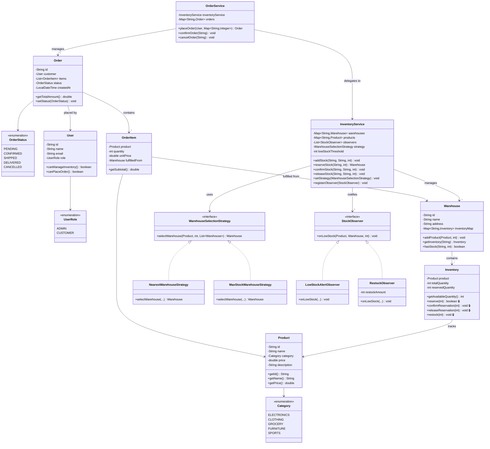
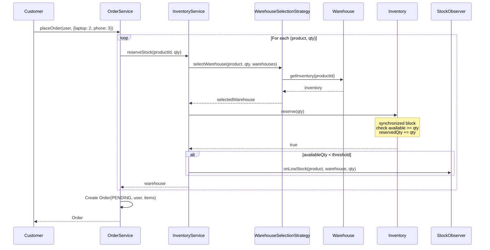
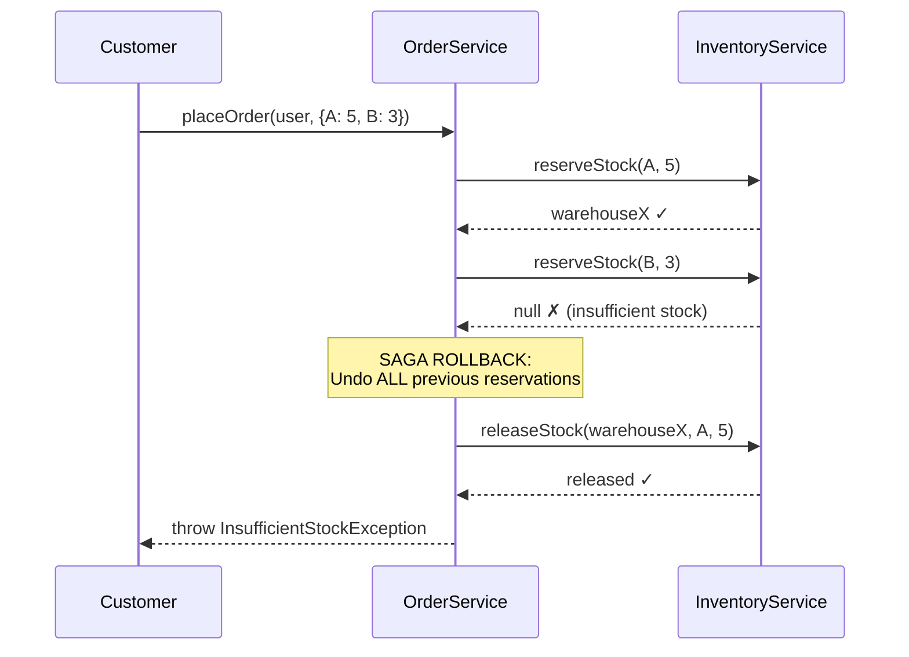
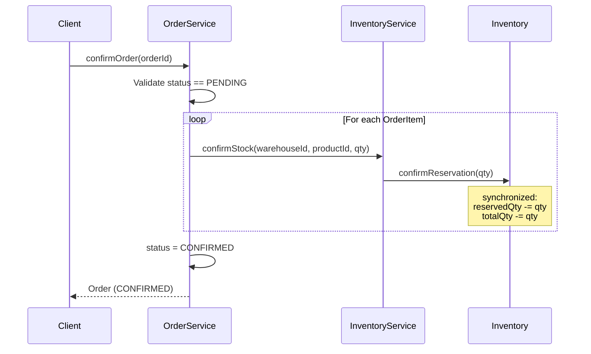
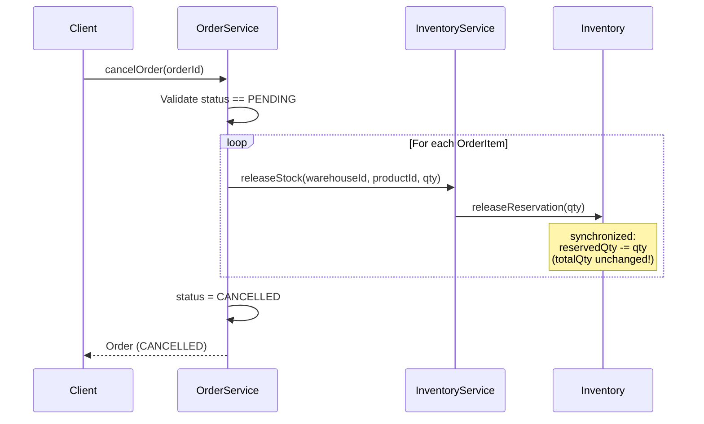

# Inventory Management System — Low Level Design (SDE 3)

> **New to LLD?** Start with [BEGINNER_GUIDE.md](./BEGINNER_GUIDE.md) first.
> It explains what inventory management is, walks through every class step-by-step,
> and traces the complete flow with real examples. Come back here once you're comfortable.

> This README is designed as an interview simulation that mirrors how a strong SDE 3
> candidate would drive a 45-60 minute LLD round at companies like Amazon, Flipkart,
> Atlassian, or Google.

---

## 0. What Differentiates SDE 3 from SDE 2 in LLD

| SDE 2 | SDE 3 |
|-------|-------|
| Waits for interviewer to define scope | **Drives scope** by asking sharp clarifying questions |
| Picks a design pattern because "it fits" | Explains **why** this pattern over alternatives, with trade-offs |
| Writes working code | Writes **extensible** code — interviewer asks "what if X?" and you don't need to rewrite |
| Mentions thread safety | **Demonstrates** thread safety with specific mechanisms and explains failure scenarios |
| Implements the happy path | Proactively handles **edge cases, rollback, and state transitions** |
| Draws a class diagram | Draws a class diagram and **explains the thinking process** — why this entity exists, why this relationship |

**Bottom line:** At SDE 3, you own the whiteboard. The interviewer is evaluating whether you can *lead* a design discussion, not just follow one.

---

## 1. The Interview Script — How to Drive the First 5 Minutes

When the interviewer says *"Design an Inventory Management System"*, here's how you open:

### 1a. Clarifying Questions You MUST Ask

> **You:** "Before I jump into design, I'd like to clarify the scope. Can I walk through a few questions?"

| # | Your Question | Why You're Asking | Likely Answer |
|---|---------------|-------------------|---------------|
| 1 | "Who are the primary actors — admin managing inventory, customers placing orders, or both?" | Defines the **bounded context**. Admin-only = catalog system. Both = full e-commerce inventory. | Both |
| 2 | "Are we dealing with a single warehouse or multiple warehouses?" | Single = simple Map. Multiple = needs **warehouse selection strategy**. This one question shapes 40% of your design. | Multiple |
| 3 | "When a customer places an order, should stock be **reserved immediately** or **deducted on shipment**?" | This is the killer SDE 3 question. It reveals you understand the reserve-confirm-release lifecycle. Most candidates miss this. | Reserve immediately, deduct on confirmation |
| 4 | "Should items in one order be fulfilled from a single warehouse, or can we split across warehouses?" | Affects strategy interface design. | Single warehouse per item (start simple, mention split as extension) |
| 5 | "Do we need concurrent order placement? Think flash sales — two customers ordering the last item." | Shows you're thinking about **thread safety** from the start, not as an afterthought. | Yes |
| 6 | "Should the system react when stock drops below a threshold — alerts, auto-restock?" | Plants the seed for **Observer pattern**. You're steering the interviewer toward your design. | Yes, that's useful |
| 7 | "Are we designing the API layer or just the core domain model and services?" | Scoping. Don't waste time on REST controllers. | Core domain |
| 8 | "Should I consider user roles — who can add stock vs. who can place orders?" | Shows role-based thinking. | Yes, admin vs customer |

> **You:** "Got it. Let me summarize what I'll design, then I'll identify the entities,
> draw the class diagram, and code the core classes."

### 1b. Scope Summary (Say This Out Loud)

*"I'm designing the core domain for a multi-warehouse inventory system. An **Admin** can manage products, warehouses, and stock levels. A **Customer** can place orders, which **reserve** stock immediately. Stock is permanently deducted on order confirmation, or released back on cancellation. The system uses a **pluggable strategy** for warehouse selection and **observers** for low-stock notifications. Thread safety is handled at the inventory level to prevent over-selling."*

This 30-second summary tells the interviewer you have the full picture before writing a single line.

---

## 2. Identifying Actors, Entities, and Relationships

### 2a. Actors

| Actor | Can Do |
|-------|--------|
| **Admin** | Add/update/remove products. Create warehouses. Add stock. View inventory across warehouses. |
| **Customer** | Browse products. Place orders. Cancel pending orders. |
| **System** | Select warehouse for fulfillment. Monitor stock levels. Trigger notifications. |

### 2b. Entity Discovery — The Thinking Process

Start from the **nouns** in the requirements:

| Noun | Keep as Entity? | Reasoning |
|------|----------------|-----------|
| Product | Yes | Core entity — has id, name, category, price |
| Warehouse | Yes | Has its own identity, address, independent stock |
| Stock / Inventory | Yes, as `Inventory` | This is the **junction entity** between Product and Warehouse. Tracks quantities. This is the most important design decision — many candidates make stock a field on Product, which breaks with multiple warehouses. |
| Order | Yes | Aggregate root — has lifecycle (state machine), contains items |
| Order Item | Yes | Links an order to a product + quantity + which warehouse fulfills it |
| User | Yes | Has role (admin/customer), places orders |
| Category | Enum | Finite set: ELECTRONICS, CLOTHING, etc. |
| Order Status | Enum | State machine: PENDING → CONFIRMED → SHIPPED → DELIVERED / CANCELLED |
| User Role | Enum | ADMIN, CUSTOMER |

### 2c. Key Relationship: Why Inventory is a Separate Entity

This is a make-or-break decision. Here's the trade-off:

```
❌ WRONG: Product has a `quantity` field
   → Breaks immediately with multiple warehouses
   → Can't track reserved vs available
   → Can't answer "how many iPhones are in Mumbai warehouse?"

✅ CORRECT: Inventory is a junction entity
   Product ────< Inventory >──── Warehouse
   
   Each Inventory tracks:
   - Which product
   - In which warehouse
   - Total quantity (physically present)
   - Reserved quantity (claimed by pending orders)
   - Available = Total - Reserved (derived)
```

If the interviewer asks *"Why not just put quantity on Product?"* — this is your answer.

### 2d. Full Entity-Relationship Map

```
User ────< Order ────< OrderItem >──── Product
                          │
                          └──── Warehouse
                                   │
                          Product ──┤
                                   │
                              Inventory
```

- A **User** places many **Orders**
- An **Order** contains many **OrderItems**
- Each **OrderItem** references a **Product** and the **Warehouse** it ships from
- A **Warehouse** has many **Inventory** records (one per product it stocks)
- **Inventory** is the junction between Product and Warehouse

---

## 3. UML Class Diagram



**Note:** 🔒 indicates `synchronized` methods — thread-safe by design.

---

## 4. Sequence Diagrams

### 4a. Place Order — Happy Path



### 4b. Place Order — Failure with Saga Rollback



**Why saga pattern?** Order placement isn't a single DB transaction — it spans multiple warehouses. If item 3 of 5 fails, you must undo items 1 and 2. This is the distributed-systems-thinking that SDE 3 candidates are expected to show.

### 4c. Order Confirmation — Stock Permanently Deducted



### 4d. Order Cancellation — Stock Released



**Key difference:** Confirm reduces *both* total and reserved. Cancel reduces *only* reserved. This is subtle and interviewers test for it.

---

## 5. The Stock Lifecycle — State Diagram

```
                    addStock(50)
                   ┌────────────────────┐
                   ▼                    │
    ┌──────────────────────────┐        │
    │   AVAILABLE              │        │
    │   (total - reserved)     │        │
    └──────────┬───────────────┘        │
               │ reserve(qty)           │
               ▼                        │
    ┌──────────────────────────┐        │
    │   RESERVED               │        │
    │   (claimed by order)     │        │
    └──────┬───────────┬───────┘        │
           │           │                │
   confirmReservation  releaseReservation
           │           │                │
           ▼           ▼                │
    ┌───────────┐  ┌────────────────────┘
    │  SOLD     │  │ Back to AVAILABLE
    │  (gone)   │  │
    └───────────┘  └─────────────────────
```

**Three quantity states:**
- `totalQuantity` = physically in warehouse
- `reservedQuantity` = claimed by pending orders
- `available` = total - reserved (what new orders can claim)

**State transitions:**
- `reserve()` → available goes down, reserved goes up
- `confirmReservation()` → total goes down, reserved goes down (item shipped)
- `releaseReservation()` → reserved goes down, available goes back up (order cancelled)
- `restock()` → total goes up, available goes up

---

## 6. Design Patterns — The WHY, Not Just the WHAT

### 6a. Strategy Pattern → Warehouse Selection

**The naive approach (and why it's wrong):**
```java
// ❌ This violates Open/Closed Principle
if (mode.equals("nearest")) {
    // pick nearest warehouse
} else if (mode.equals("maxstock")) {
    // pick warehouse with most stock
} else if (mode.equals("roundrobin")) {
    // round robin
}
// Every new strategy = modify this method
```

**Why Strategy?**
- New strategies (cheapest-shipping, geographic-zone, round-robin) are added by implementing ONE interface
- InventoryService never changes when strategies are added
- Strategy can be **swapped at runtime** — e.g., switch to "nearest" during normal hours, "max-stock" during flash sales

**When the interviewer asks "Why not just use if-else?":**
> "If-else would work for 2-3 strategies, but it violates Open/Closed Principle. More importantly, different warehouse selection logic has different complexity — NearestWarehouse needs a distance calculation, MaxStock needs a max-search. Mixing these in one method makes testing and reasoning about each strategy harder. Strategy pattern gives me testability and single responsibility per algorithm."

### 6b. Observer Pattern → Low Stock Notifications

**Why not just call `sendAlert()` directly?**
```java
// ❌ InventoryService now knows about email, Slack, and auto-restock
if (stock < threshold) {
    emailService.sendLowStockEmail(product);     // tight coupling
    slackService.postToChannel(product);          // tight coupling
    autoRestockService.triggerRestock(product);   // tight coupling
}
```

**Why Observer?**
- InventoryService doesn't know (or care) what happens when stock is low
- Adding a PagerDuty integration = add one class implementing `StockObserver`. Zero changes to existing code.
- Each observer is independently testable
- Observers can be added/removed at runtime

**When the interviewer asks "Why Observer over an event bus?":**
> "For this scope, Observer is sufficient and simpler. If we needed cross-service communication (e.g., microservices), I'd use an event bus or message queue like Kafka. Observer is the in-process equivalent — same decoupling principle, lighter weight."

### 6c. Patterns I Deliberately Did NOT Use (and Why)

| Pattern | Why Not |
|---------|---------|
| **Singleton** for InventoryService | Makes testing harder (can't inject mocks). Constructor injection is cleaner. If the interviewer pushes for Singleton, mention the double-checked locking pitfall. |
| **Factory** for Order creation | Orders have one constructor path — no polymorphic variants. Factory adds complexity without value here. |
| **Abstract Factory** | We don't have families of related objects to create together. |
| **Builder** for Product | Could argue for it if Product had 10+ fields. With 5 fields, constructor is fine. Mention it as extension point. |

---

## 7. Trade-off Analysis — What Interviewers Probe

### 7a. synchronized vs ReentrantReadWriteLock vs Optimistic Locking

| Approach | Pros | Cons | When to use |
|----------|------|------|-------------|
| `synchronized` (our choice) | Simple, correct, no external deps | Exclusive lock — readers block readers | Low-to-medium concurrency. Fine for interview. |
| `ReentrantReadWriteLock` | Readers don't block each other | More complex code, risk of writer starvation | High read:write ratio (many stock checks, few orders) |
| Optimistic locking (version field) | No locks, maximum throughput | Retry logic needed on conflict | Database-backed inventory, high throughput |
| Redis DECR | Atomic, distributed, fast | External dependency, eventual consistency | Distributed systems, flash sales |

**What to say in interview:** *"I'm using synchronized here because it's correct and simple for demonstrating the design. In production with high concurrency, I'd use optimistic locking with a version field in the database, or Redis atomic operations for hot products during flash sales."*

### 7b. Where to Put the Inventory? Warehouse vs Separate Map

| Approach | Pros | Cons |
|----------|------|------|
| **Inventory inside Warehouse** (our choice) | Natural ownership — warehouse "has" inventory. Easy to ask "what does this warehouse stock?" | Harder to ask "across all warehouses, how much iPhone stock exists?" (need to iterate all warehouses) |
| **Central inventory map** `Map<(productId, warehouseId), Inventory>` | Fast cross-warehouse queries. Closer to DB schema. | Warehouse object doesn't know its own stock. Less OO. |

**What to say:** *"I chose to put inventory inside Warehouse because it models real-world ownership. For cross-warehouse queries, I'd add an aggregation method in InventoryService. In a database design, the Inventory table has a composite key of (product_id, warehouse_id) anyway."*

### 7c. Order Atomicity — Why Saga Over Two-Phase Commit

Our `placeOrder()` reserves items sequentially and rolls back on failure. This is a **saga pattern**.

| Approach | Pros | Cons |
|----------|------|------|
| **Saga with compensating actions** (our choice) | Simple, works in-process and across services | Intermediate states visible (item A reserved, B not yet) |
| **Two-phase commit** | True atomicity | Complex, slow, doesn't scale across services |
| **Try-Confirm-Cancel (TCC)** | Explicit three-phase lifecycle | More code, but production-grade |

**What to say:** *"Saga is the pragmatic choice here. Each reservation is independently atomic (synchronized). If one fails, I compensate by releasing previous reservations. In a microservices architecture, I'd use TCC or an event-driven saga with a saga orchestrator."*

---

## 8. Thread Safety Deep Dive

### 8a. The Race Condition We're Preventing

```
Time     Thread A (Order 1)         Thread B (Order 2)        Available
─────    ─────────────────          ─────────────────         ─────────
T1       read available = 5                                      5
T2                                  read available = 5           5
T3       available >= 3? YES                                     5
T4                                  available >= 4? YES          5
T5       reserved += 3                                           2
T6                                  reserved += 4                ← OVER-SOLD! -2

WITHOUT synchronized, both threads see available=5 and both proceed.
Total reserved = 7, but only 5 exist. Customer gets a "sorry, out of stock" email.
```

### 8b. How synchronized Fixes It

```
Time     Thread A (Order 1)              Thread B (Order 2)
─────    ─────────────────               ─────────────────
T1       ACQUIRE lock on Inventory
T2       read available = 5
T3       5 >= 3? YES → reserved += 3
T4       RELEASE lock
T5                                       ACQUIRE lock on Inventory
T6                                       read available = 2
T7                                       2 >= 4? NO → return false
T8                                       RELEASE lock

Thread B sees the updated available=2 and correctly fails.
```

### 8c. Lock Granularity Analysis

```
Global lock (entire system)  →  One order at a time. Correct but terrible throughput.
Warehouse-level lock         →  Better. But ordering iPhone in Mumbai blocks ordering
                                 MacBook in Mumbai too (unrelated products).
Product-level lock           →  Better. But same product in different warehouses blocked.
Inventory-level lock ✅      →  Best. Each (product, warehouse) pair has its own lock.
                                 iPhone-in-Mumbai and iPhone-in-Bangalore are independent.
```

Our design uses Inventory-level locks (synchronized on each Inventory instance). This is the correct granularity.

---

## 9. SOLID Principles — Concrete Mapping

| Principle | Where Exactly | What Would Break It |
|-----------|---------------|---------------------|
| **S** — Single Responsibility | `Inventory` only manages quantities. `Warehouse` only manages its product catalog. `OrderService` only manages order lifecycle. `InventoryService` only manages stock operations. | Putting order logic inside Inventory. Putting notification logic inside InventoryService directly. |
| **O** — Open/Closed | `WarehouseSelectionStrategy` interface. `StockObserver` interface. | Using if-else for strategy selection. Hardcoding email alerts in InventoryService. |
| **L** — Liskov Substitution | Any `WarehouseSelectionStrategy` implementation can replace any other. `InventoryService` doesn't know which strategy it's using. | A strategy implementation that throws "not supported" for some inputs — violates the contract. |
| **I** — Interface Segregation | `StockObserver` has exactly one method: `onLowStock()`. | A fat `InventoryEventListener` interface with `onLowStock()`, `onRestock()`, `onProductAdded()`, `onWarehouseCreated()` — forces implementors to stub methods they don't need. |
| **D** — Dependency Inversion | `InventoryService` depends on `WarehouseSelectionStrategy` (abstraction), injected via constructor. Does NOT import `NearestWarehouseStrategy`. | `new NearestWarehouseStrategy()` inside InventoryService. |

---

## 10. Edge Cases — Bring These Up Proactively

| Edge Case | How We Handle It | What to Say |
|-----------|-------------------|-------------|
| **Order with 0 quantity** | `Inventory.reserve()` throws `IllegalArgumentException` for qty ≤ 0 | "Input validation at the model level" |
| **Reserve more than available** | `reserve()` returns `false`, OrderService throws `InsufficientStockException` | "Fail-fast with clear exception" |
| **Confirm more than reserved** | `confirmReservation()` throws `IllegalStateException` | "Defensive programming — this indicates a bug in the service layer" |
| **Double cancellation** | `cancelOrder()` checks status, throws if already CANCELLED | "Idempotency guard" |
| **Cancel a confirmed order** | Only PENDING orders can be cancelled (our design). Mention: in production, CONFIRMED orders need a refund flow. | "State machine enforces valid transitions" |
| **Reservation timeout (stale PENDING)** | NOT implemented — but mention: "In production, I'd add a `reservedUntil` timestamp to Inventory and a scheduled job to release expired reservations." | This is a **must-mention** for SDE 3 |
| **Product in no warehouse** | `reserveStock()` returns null → `InsufficientStockException` | "Same flow as out-of-stock" |
| **Admin restocks during active orders** | `restock()` only increases `totalQuantity`, never touches `reservedQuantity`. Both are synchronized. Safe. | "Restock and reservation are independent state transitions" |
| **Product price changes after order placed** | `OrderItem.unitPrice` captures `product.getPrice()` at order creation time. `getSubtotal()` uses `unitPrice`, not the live product price. Future price changes don't affect existing orders. | "Price snapshotting — `unitPrice` freezes the price at order time" |

---

## 11. Common Follow-up Questions — Strong Answers

| Interviewer Asks | Strong SDE 3 Answer |
|-----------------|---------------------|
| **"How would you handle split fulfillment?"** | "Change `WarehouseSelectionStrategy` to return `List<Pair<Warehouse, Integer>>` instead of a single Warehouse. The strategy splits the quantity across warehouses. OrderItem becomes a list of `FulfillmentUnit`s. The interface change is backward-compatible if I default to a single-element list." |
| **"What if two users order the last item simultaneously?"** | "The `synchronized` block on `Inventory.reserve()` ensures only one succeeds. The other gets `reserve() → false` and an InsufficientStockException. No over-selling. For distributed systems, I'd use Redis `DECR` with a check, or optimistic locking with retry." |
| **"How would you design the database schema?"** | "`products(id, name, category, price)`, `warehouses(id, name, address)`, `inventory(product_id, warehouse_id, total_qty, reserved_qty)` with composite PK, `orders(id, user_id, status, created_at)`, `order_items(id, order_id, product_id, warehouse_id, quantity, unit_price)`. Inventory table uses `SELECT ... FOR UPDATE` for row-level locking." |
| **"How would you handle returns?"** | "Add `RETURN_REQUESTED` and `RETURNED` to OrderStatus. Create a `ReturnService` that validates the order is DELIVERED, then calls `inventoryService.addStock()` to return items to the originating warehouse. Fire a `StockReturnObserver` event." |
| **"What if admin changes product price after order is placed?"** | "`OrderItem` captures `unitPrice = product.getPrice()` at order creation time. `getSubtotal()` uses this snapshot, not the live price. Past orders are never affected by future price changes. This is called price snapshotting." |
| **"How would you add pricing rules?"** | "Strategy pattern again: `PricingStrategy` interface with `calculatePrice(Product, int quantity, User)`. Implementations: `StandardPricing`, `BulkDiscountPricing`, `MembershipPricing`. Inject into OrderService." |
| **"What about reservation timeouts?"** | "Add `reservedUntil: LocalDateTime` to the reservation. A `ScheduledExecutorService` runs every N minutes, finds expired reservations, and calls `releaseReservation()`. This prevents cart-hoarders from blocking inventory indefinitely." |
| **"How would you add audit logging?"** | "Observer pattern — add an `AuditLogObserver` that implements `StockObserver`. For order events, add an `OrderEventObserver` interface. Each observer writes to an append-only audit log. In production, publish events to Kafka for async processing." |
| **"How would you test this?"** | "Unit test each class independently: Inventory thread safety with CountDownLatch, Strategy implementations with known warehouse lists, OrderService rollback by mocking InventoryService to fail on the Nth call. Integration test: full placeOrder → confirm → verify stock deducted." |

---

## 12. Extension Points — "What Would You Add With More Time?"

Say these proactively in the last 5 minutes:

1. **Reservation TTL** — `reservedUntil` field + scheduled cleanup. Prevents indefinite stock hoarding.
2. **Product search** — `ProductService.searchByCategory()`, `searchByName()`. In production, backed by Elasticsearch.
3. **Bulk operations** — `addStock(Map<ProductId, Qty>)` for warehouse restocking.
4. **Event sourcing** — Instead of mutating quantities, append events (`StockReserved`, `StockConfirmed`, `StockReleased`). Current state = replay of events. Enables full audit trail.
5. **Distributed locking** — For multi-instance deployment, replace `synchronized` with Redis-based distributed locks or DB-level `SELECT FOR UPDATE`.
6. **Circuit breaker** — If a warehouse is temporarily unreachable, skip it in strategy selection.

---

## 13. Project Structure

```
src/
├── model/
│   ├── UserRole.java                  # ADMIN, CUSTOMER (enum)
│   ├── User.java                      # User with role-based permissions
│   ├── Category.java                  # Product categories (enum)
│   ├── Product.java                   # Product entity
│   ├── Inventory.java                 # Thread-safe stock tracking (CORE CLASS)
│   ├── Warehouse.java                 # Warehouse with inventory map
│   ├── OrderStatus.java              # Order lifecycle states (enum)
│   ├── OrderItem.java                 # Line item in an order
│   └── Order.java                     # Order aggregate with user reference
├── strategy/
│   ├── WarehouseSelectionStrategy.java  # Strategy interface
│   ├── NearestWarehouseStrategy.java    # Pick first available warehouse
│   └── MaxStockWarehouseStrategy.java   # Pick warehouse with highest stock
├── observer/
│   ├── StockObserver.java               # Observer interface
│   ├── LowStockAlertObserver.java       # Logs low-stock warnings
│   └── RestockObserver.java             # Auto-restocks on low stock
├── exception/
│   ├── InsufficientStockException.java
│   └── OrderNotFoundException.java
├── service/
│   ├── InventoryService.java            # Stock operations + strategy + observers
│   └── OrderService.java               # Order lifecycle + saga rollback
└── Main.java                            # Full demo: setup → order → confirm → cancel → strategy switch → rollback → price snapshot
```

### Compile & Run
```bash
cd src/
javac -d ../out model/*.java strategy/*.java observer/*.java exception/*.java service/*.java Main.java
cd ../out && java Main
```
