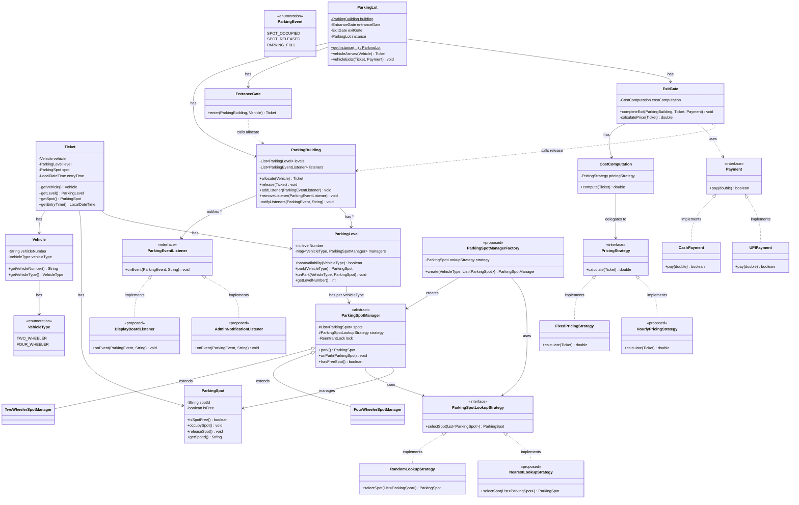

```mermaid
classDiagram
    direction TB

    %% ========================
    %% ENUMS
    %% ========================
    class VehicleType {
        <<enumeration>>
        TWO_WHEELER
        FOUR_WHEELER
    }

    class ParkingEvent {
        <<enumeration>>
        SPOT_OCCUPIED
        SPOT_RELEASED
        PARKING_FULL
    }

    %% ========================
    %% ENTITIES
    %% ========================
    class Vehicle {
        -String vehicleNumber
        -VehicleType vehicleType
        +getVehicleNumber() String
        +getVehicleType() VehicleType
    }

    class ParkingSpot {
        -String spotId
        -boolean isFree
        +isSpotFree() boolean
        +occupySpot() void
        +releaseSpot() void
        +getSpotId() String
    }

    class Ticket {
        -Vehicle vehicle
        -ParkingLevel level
        -ParkingSpot spot
        -LocalDateTime entryTime
        +getVehicle() Vehicle
        +getLevel() ParkingLevel
        +getSpot() ParkingSpot
        +getEntryTime() LocalDateTime
    }

    %% ========================
    %% STRATEGY: Spot Lookup
    %% ========================
    class ParkingSpotLookupStrategy {
        <<interface>>
        +selectSpot(List~ParkingSpot~) ParkingSpot
    }

    class RandomLookupStrategy {
        +selectSpot(List~ParkingSpot~) ParkingSpot
    }

    class NearestLookupStrategy {
        <<proposed>>
        +selectSpot(List~ParkingSpot~) ParkingSpot
    }

    %% ========================
    %% STRATEGY: Pricing
    %% ========================
    class PricingStrategy {
        <<interface>>
        +calculate(Ticket) double
    }

    class FixedPricingStrategy {
        +calculate(Ticket) double
    }

    class HourlyPricingStrategy {
        <<proposed>>
        +calculate(Ticket) double
    }

    class CostComputation {
        -PricingStrategy pricingStrategy
        +compute(Ticket) double
    }

    %% ========================
    %% STRATEGY: Payment
    %% ========================
    class Payment {
        <<interface>>
        +pay(double) boolean
    }

    class CashPayment {
        +pay(double) boolean
    }

    class UPIPayment {
        +pay(double) boolean
    }

    %% ========================
    %% TEMPLATE METHOD: Spot Managers
    %% ========================
    class ParkingSpotManager {
        <<abstract>>
        #List~ParkingSpot~ spots
        #ParkingSpotLookupStrategy strategy
        -ReentrantLock lock
        +park() ParkingSpot
        +unPark(ParkingSpot) void
        +hasFreeSpot() boolean
    }

    class TwoWheelerSpotManager {
    }

    class FourWheelerSpotManager {
    }

    %% ========================
    %% FACTORY (proposed)
    %% ========================
    class ParkingSpotManagerFactory {
        <<proposed>>
        -ParkingSpotLookupStrategy strategy
        +create(VehicleType, List~ParkingSpot~) ParkingSpotManager
    }

    %% ========================
    %% OBSERVER (proposed)
    %% ========================
    class ParkingEventListener {
        <<interface>>
        <<proposed>>
        +onEvent(ParkingEvent, String) void
    }

    class DisplayBoardListener {
        <<proposed>>
        +onEvent(ParkingEvent, String) void
    }

    class AdminNotificationListener {
        <<proposed>>
        +onEvent(ParkingEvent, String) void
    }

    %% ========================
    %% CORE: Parking Lot System
    %% ========================
    class ParkingLot {
        -ParkingBuilding building$
        -EntranceGate entranceGate
        -ExitGate exitGate
        -ParkingLot instance$
        +getInstance(...)$ ParkingLot
        +vehicleArrives(Vehicle) Ticket
        +vehicleExits(Ticket, Payment) void
    }

    class ParkingBuilding {
        -List~ParkingLevel~ levels
        -List~ParkingEventListener~ listeners
        +allocate(Vehicle) Ticket
        +release(Ticket) void
        +addListener(ParkingEventListener) void
        +removeListener(ParkingEventListener) void
        -notifyListeners(ParkingEvent, String) void
    }

    class ParkingLevel {
        -int levelNumber
        -Map~VehicleType, ParkingSpotManager~ managers
        +hasAvailability(VehicleType) boolean
        +park(VehicleType) ParkingSpot
        +unPark(VehicleType, ParkingSpot) void
        +getLevelNumber() int
    }

    class EntranceGate {
        +enter(ParkingBuilding, Vehicle) Ticket
    }

    class ExitGate {
        -CostComputation costComputation
        +completeExit(ParkingBuilding, Ticket, Payment) void
        -calculatePrice(Ticket) double
    }

    %% ========================
    %% RELATIONSHIPS
    %% ========================

    %% Ticket composition
    Ticket --> Vehicle : has
    Ticket --> ParkingSpot : has
    Ticket --> ParkingLevel : has

    %% Vehicle uses enum
    Vehicle --> VehicleType : has

    %% Strategy: Lookup
    ParkingSpotLookupStrategy <|.. RandomLookupStrategy : implements
    ParkingSpotLookupStrategy <|.. NearestLookupStrategy : implements

    %% Strategy: Pricing
    PricingStrategy <|.. FixedPricingStrategy : implements
    PricingStrategy <|.. HourlyPricingStrategy : implements
    CostComputation --> PricingStrategy : delegates to

    %% Strategy: Payment
    Payment <|.. CashPayment : implements
    Payment <|.. UPIPayment : implements

    %% Template Method: Managers
    ParkingSpotManager <|-- TwoWheelerSpotManager : extends
    ParkingSpotManager <|-- FourWheelerSpotManager : extends
    ParkingSpotManager --> ParkingSpotLookupStrategy : uses
    ParkingSpotManager --> ParkingSpot : manages

    %% Factory
    ParkingSpotManagerFactory --> ParkingSpotManager : creates
    ParkingSpotManagerFactory --> ParkingSpotLookupStrategy : uses

    %% Observer
    ParkingEventListener <|.. DisplayBoardListener : implements
    ParkingEventListener <|.. AdminNotificationListener : implements
    ParkingBuilding --> ParkingEventListener : notifies *

    %% Core system composition
    ParkingLot --> ParkingBuilding : has
    ParkingLot --> EntranceGate : has
    ParkingLot --> ExitGate : has
    ParkingBuilding --> ParkingLevel : has *
    ParkingLevel --> ParkingSpotManager : has per VehicleType
    ExitGate --> CostComputation : has
    ExitGate ..> Payment : uses

    %% Gate interactions
    EntranceGate ..> ParkingBuilding : calls allocate
    ExitGate ..> ParkingBuilding : calls release
```