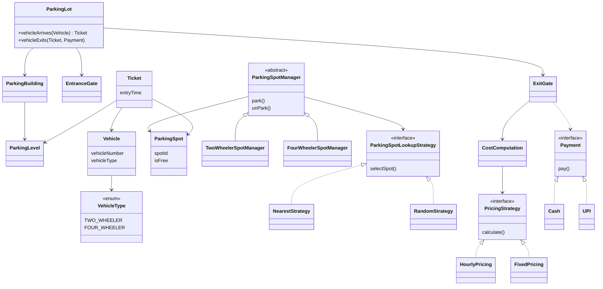

```mermaid
classDiagram
    direction TB

    %% ========= CORE =========
    class ParkingLot {
        +vehicleArrives(Vehicle) Ticket
        +vehicleExits(Ticket, Payment)
    }

    class ParkingBuilding
    class ParkingLevel

    class EntranceGate
    class ExitGate

    ParkingLot --> ParkingBuilding
    ParkingLot --> EntranceGate
    ParkingLot --> ExitGate
    ParkingBuilding --> ParkingLevel

    %% ========= VEHICLE =========
    class Vehicle {
        vehicleNumber
        vehicleType
    }

    class VehicleType {
        <<enum>>
        TWO_WHEELER
        FOUR_WHEELER
    }

    Vehicle --> VehicleType

    %% ========= PARKING =========
    class ParkingSpot {
        spotId
        isFree
    }

    class ParkingSpotManager {
        <<abstract>>
        park()
        unPark()
    }

    class TwoWheelerSpotManager
    class FourWheelerSpotManager

    ParkingSpotManager <|-- TwoWheelerSpotManager
    ParkingSpotManager <|-- FourWheelerSpotManager
    ParkingSpotManager --> ParkingSpot

    %% ========= STRATEGY: SPOT =========
    class ParkingSpotLookupStrategy {
        <<interface>>
        selectSpot()
    }

    class NearestStrategy
    class RandomStrategy

    ParkingSpotLookupStrategy <|.. NearestStrategy
    ParkingSpotLookupStrategy <|.. RandomStrategy
    ParkingSpotManager --> ParkingSpotLookupStrategy

    %% ========= TICKET =========
    class Ticket {
        entryTime
    }

    Ticket --> Vehicle
    Ticket --> ParkingSpot
    Ticket --> ParkingLevel

    %% ========= PRICING =========
    class PricingStrategy {
        <<interface>>
        calculate()
    }

    class HourlyPricing
    class FixedPricing

    PricingStrategy <|.. HourlyPricing
    PricingStrategy <|.. FixedPricing

    class CostComputation
    CostComputation --> PricingStrategy

    %% ========= PAYMENT =========
    class Payment {
        <<interface>>
        pay()
    }

    class Cash
    class UPI

    Payment <|.. Cash
    Payment <|.. UPI

    ExitGate --> CostComputation
    ExitGate ..> Payment
```
