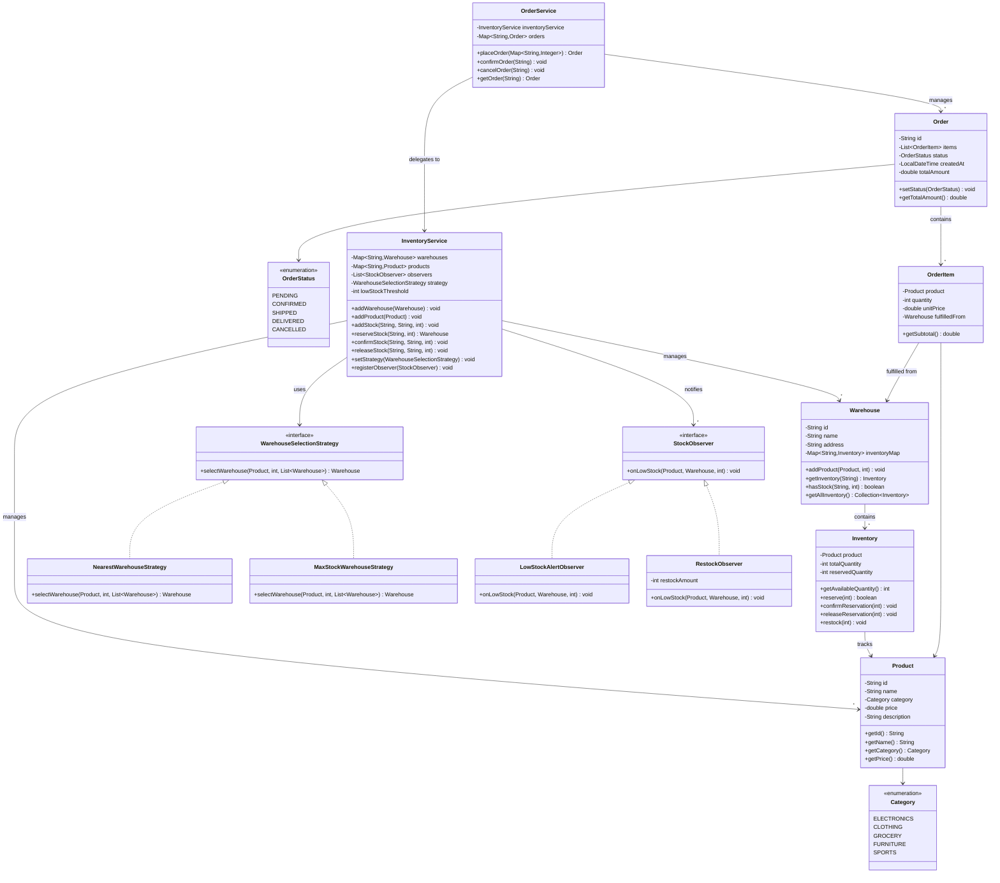
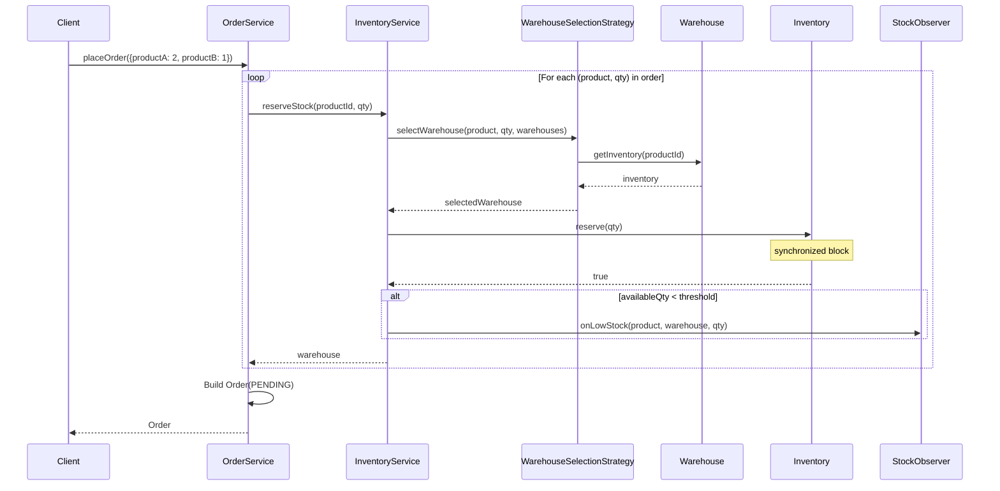
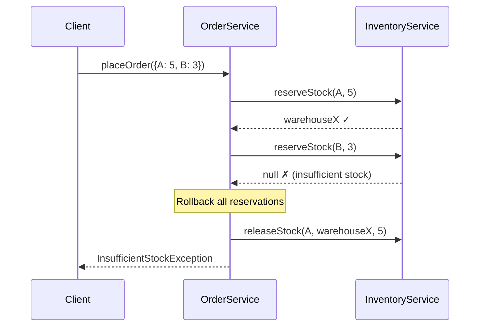
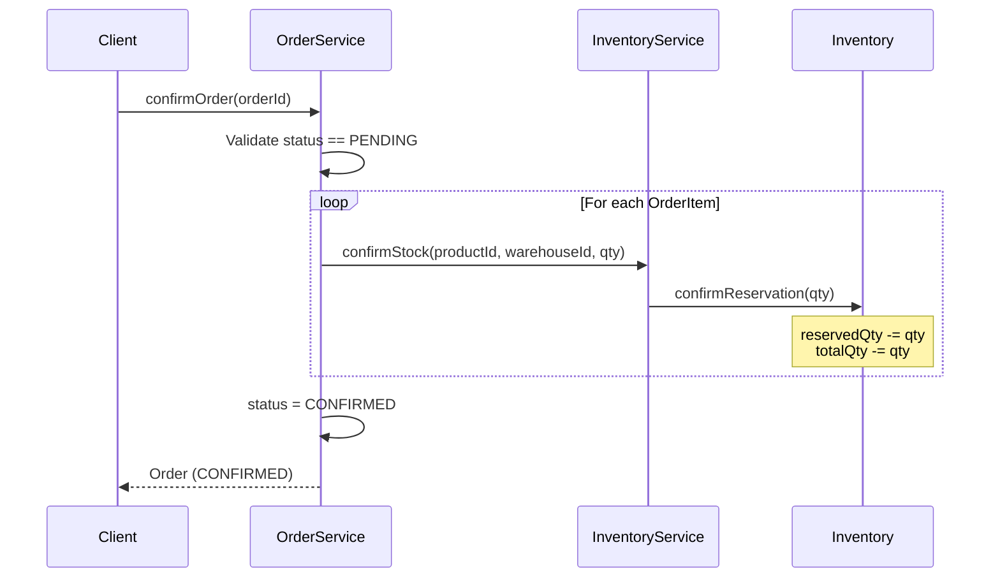

# Inventory Management System - Low Level Design

## Interview Approach (45-60 minute LLD round)

| Phase | Time | What to do |
|-------|------|------------|
| 1. Clarify requirements | 5 min | Ask questions, define scope, list functional & non-functional requirements |
| 2. Identify entities | 5 min | List core classes, enums, relationships |
| 3. Draw class diagram | 10 min | UML class diagram on whiteboard/doc |
| 4. Design patterns & trade-offs | 5 min | Justify your pattern choices |
| 5. Write code | 20-25 min | Top-down: models → interfaces → services |
| 6. Extensibility & follow-ups | 5 min | Discuss scaling, improvements, edge cases |

> **SDE 3 Expectation:** Clean abstractions, proper separation of concerns, awareness of
> concurrency, extensible design using SOLID principles. You're expected to *drive* the
> discussion, not wait for hints.

---

## 1. Requirements

### Functional Requirements
1. **Product Management** — Add, update, remove products with categories
2. **Warehouse Management** — Support multiple warehouses, each with independent stock
3. **Inventory Tracking** — Track total, reserved, and available quantities per product per warehouse
4. **Order Placement** — Place orders that reserve stock atomically; rollback on failure
5. **Order Lifecycle** — Pending → Confirmed → Shipped → Delivered, or Cancelled at any stage
6. **Warehouse Selection** — Pluggable strategy to decide which warehouse fulfills an order item
7. **Low Stock Alerts** — Notify when stock falls below a configurable threshold
8. **Restocking** — Add stock to specific warehouses

### Non-Functional Requirements
1. **Thread Safety** — Concurrent order placement must not over-sell
2. **Extensibility** — Easy to add new warehouse selection strategies, notification channels
3. **Single Responsibility** — Each class has one reason to change

### Out of Scope (mention in interview)
- Payment processing, shipping logistics, user authentication, UI/API layer

---

## 2. Key Entities & Relationships

```
Product ────< Inventory >──── Warehouse
                                  │
Order ────< OrderItem >───────────┘
                │
                └──── Product
```

**Read as:**
- A `Warehouse` contains many `Inventory` records (one per product)
- An `Inventory` links exactly one `Product` to one `Warehouse` with quantity info
- An `Order` contains many `OrderItem`s
- Each `OrderItem` references a `Product` and the `Warehouse` it's fulfilled from

---

## 3. UML Class Diagram



---

## 4. Sequence Diagrams

### 4a. Place Order (Happy Path)



### 4b. Place Order (Failure + Rollback)



### 4c. Order Confirmation Flow



---

## 5. Design Patterns Used

### 5a. Strategy Pattern — Warehouse Selection

**Problem:** Different fulfillment strategies (nearest warehouse, max stock, round-robin) should be swappable without modifying InventoryService.

**Solution:** Define `WarehouseSelectionStrategy` interface. Each strategy is a separate class. InventoryService holds a reference to the interface, not the implementation.

```
┌──────────────────────────────────┐
│       InventoryService           │
│  ─────────────────────────────   │
│  - strategy: WarehouseSelection  │──────┐
│    Strategy                      │      │
│  + setStrategy(strategy)         │      │
└──────────────────────────────────┘      │
                                          ▼
                            ┌──────────────────────────┐
                            │ «interface»               │
                            │ WarehouseSelectionStrategy │
                            │ + selectWarehouse(...)     │
                            └──────────┬───────────────┘
                       ┌───────────────┼────────────────┐
                       ▼               ▼                ▼
                 ┌───────────┐  ┌────────────┐  ┌──────────────┐
                 │ Nearest   │  │ MaxStock   │  │ RoundRobin   │
                 │ Warehouse │  │ Warehouse  │  │ Warehouse    │
                 │ Strategy  │  │ Strategy   │  │ Strategy     │
                 └───────────┘  └────────────┘  └──────────────┘
```

**Why Strategy?** Open/Closed Principle — add new strategies without touching existing code.

### 5b. Observer Pattern — Low Stock Alerts

**Problem:** When stock drops below a threshold, multiple systems need to react (log alert, send email, auto-restock). These reactions should be decoupled from inventory logic.

**Solution:** `InventoryService` maintains a list of `StockObserver`s. When stock drops below threshold, all observers are notified.

```
┌──────────────────┐        ┌───────────────────┐
│ InventoryService │───────>│ «interface»        │
│                  │  1..*  │ StockObserver      │
│ + registerObs()  │        │ + onLowStock(...)  │
│ + notifyObs()    │        └────────┬───────────┘
└──────────────────┘            ┌────┴─────┐
                                ▼          ▼
                      ┌──────────────┐ ┌────────────┐
                      │ LowStock     │ │ Restock    │
                      │ AlertObserver│ │ Observer   │
                      └──────────────┘ └────────────┘
```

**Why Observer?** Adding new notification channels (Slack, PagerDuty) requires zero changes to InventoryService.

### 5c. Other Patterns Present
- **Repository Pattern** — `Map<String, X>` in services acts as an in-memory repository (in production, swap for DB-backed repos)
- **Builder Pattern** — Could be used for Order creation (mentioned as extension point)

---

## 6. SOLID Principles Demonstrated

| Principle | Where | How |
|-----------|-------|-----|
| **S**ingle Responsibility | Each model has one job: `Inventory` manages quantities, `Warehouse` manages its inventory map, `OrderService` manages order lifecycle | No God classes |
| **O**pen/Closed | `WarehouseSelectionStrategy` interface | Add new strategies without modifying `InventoryService` |
| **L**iskov Substitution | Any `WarehouseSelectionStrategy` impl can replace another | `InventoryService` works with any strategy |
| **I**nterface Segregation | `StockObserver` has only `onLowStock()` | Observers don't need to implement unrelated methods |
| **D**ependency Inversion | `InventoryService` depends on `WarehouseSelectionStrategy` (abstraction), not `NearestWarehouseStrategy` (concrete) | Constructor injection of strategy |

---

## 7. Thread Safety Design

### Where concurrency matters:
1. **`Inventory.reserve()`** — Two threads placing orders for the same product in the same warehouse
2. **`Inventory.restock()`** — Admin restocking while orders are being placed

### Solution:
- All mutating methods in `Inventory` are `synchronized` (monitor on the Inventory instance)
- Each `Inventory` is per-product-per-warehouse, so locks are granular (no warehouse-wide bottleneck)
- `Warehouse.inventoryMap` uses `ConcurrentHashMap` for safe concurrent reads/writes of the map itself
- `OrderService.placeOrder()` handles partial failure with rollback (saga-like pattern)

### Concurrency flow for reserve:
```
Thread A: reserve(5)  ──┐
                        ├── synchronized on same Inventory instance
Thread B: reserve(3)  ──┘

Thread A enters first:
  available = 100 - 0 = 100 >= 5 ✓ → reserved = 5

Thread B enters next:
  available = 100 - 5 = 95 >= 3 ✓ → reserved = 8

No over-selling possible.
```

---

## 8. Common Interview Follow-up Questions

| Question | How to answer |
|----------|---------------|
| **How would you handle split fulfillment?** | If no single warehouse has enough stock, split the OrderItem across warehouses. Strategy returns `List<Pair<Warehouse, Integer>>` instead of single Warehouse. |
| **How to support flash sales / high concurrency?** | Use optimistic locking with version numbers instead of synchronized. Consider Redis-backed inventory with atomic DECR. |
| **How to add new product attributes?** | Use composition: `Map<String, Object> attributes` or a separate `ProductAttribute` entity. |
| **How to handle returns?** | Add `RETURNED` to OrderStatus. Create `ReturnService` that calls `inventoryService.addStock()` back to the warehouse. |
| **Database schema?** | Products, Warehouses, Inventory (junction table with product_id + warehouse_id as composite key), Orders, OrderItems. |
| **How to add pricing rules (bulk discount)?** | Strategy pattern again: `PricingStrategy` interface with implementations like `BulkDiscountPricing`, `SeasonalPricing`. |
| **How to ensure exactly-once order processing?** | Idempotency key on orders. Check if orderId already exists before processing. |
| **How to scale across regions?** | Partition warehouses by region. Route requests to nearest region's inventory service. Eventually consistent cross-region stock view. |

---

## 9. Project Structure

```
src/
├── model/
│   ├── Category.java              # Product categories (enum)
│   ├── Product.java               # Product entity
│   ├── Inventory.java             # Thread-safe stock tracking (core)
│   ├── Warehouse.java             # Warehouse with inventory map
│   ├── OrderStatus.java           # Order lifecycle states (enum)
│   ├── OrderItem.java             # Single line item in an order
│   └── Order.java                 # Order aggregate
├── strategy/
│   ├── WarehouseSelectionStrategy.java  # Strategy interface
│   ├── NearestWarehouseStrategy.java    # Pick first available warehouse
│   └── MaxStockWarehouseStrategy.java   # Pick warehouse with most stock
├── observer/
│   ├── StockObserver.java               # Observer interface
│   ├── LowStockAlertObserver.java       # Logs low stock warnings
│   └── RestockObserver.java             # Auto-restocks on low stock
├── exception/
│   ├── InsufficientStockException.java  # Thrown when stock unavailable
│   └── OrderNotFoundException.java      # Thrown for invalid order IDs
├── service/
│   ├── InventoryService.java      # Core inventory operations
│   └── OrderService.java          # Order lifecycle management
└── Main.java                      # Driver / demo
```
